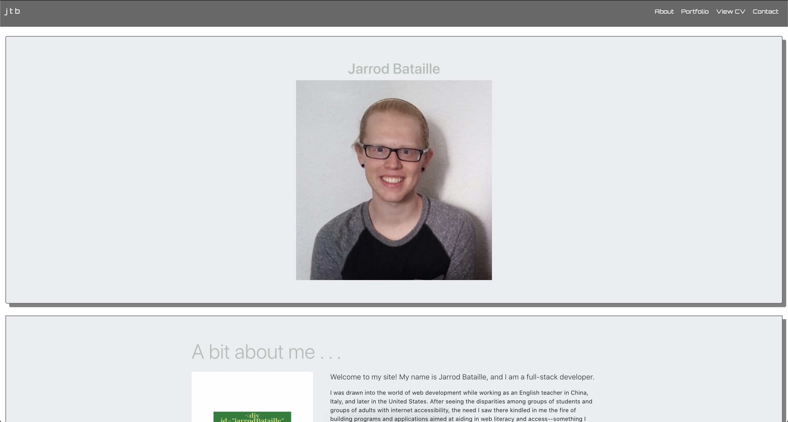
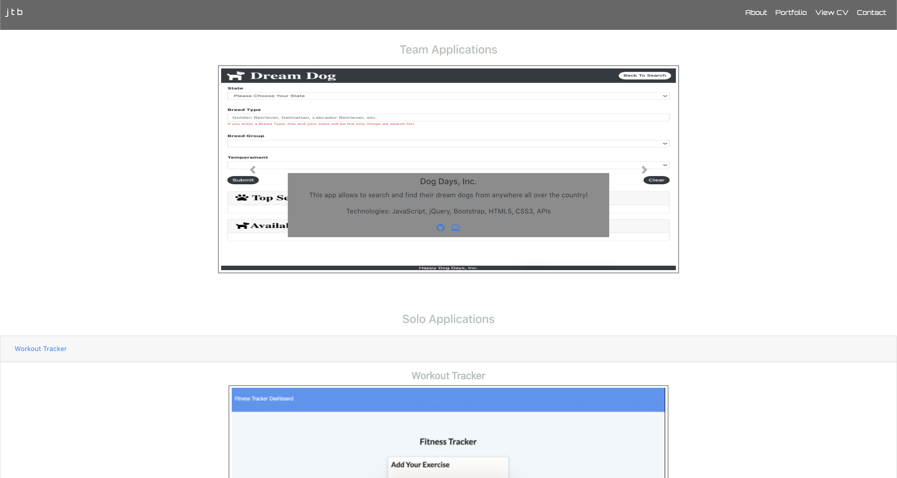
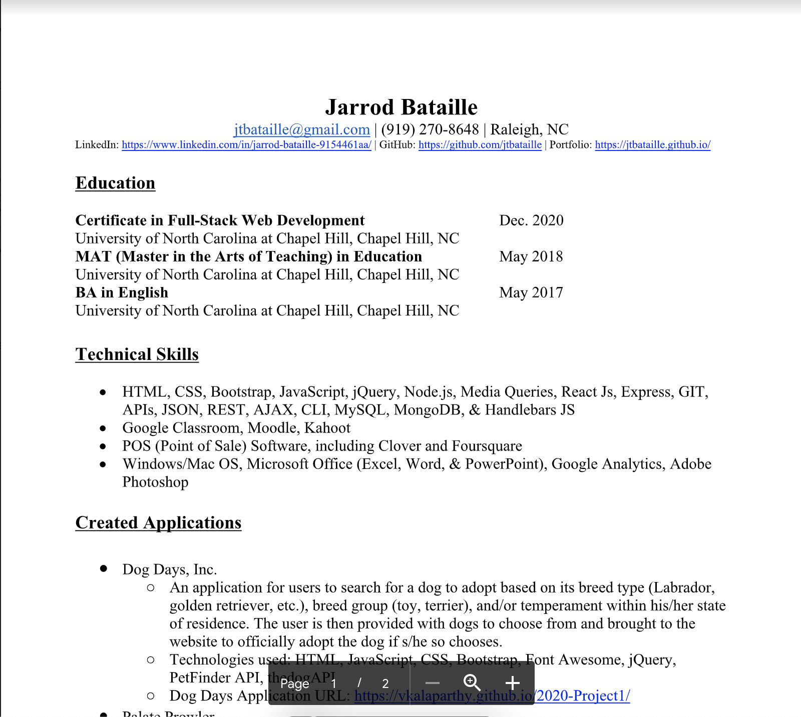
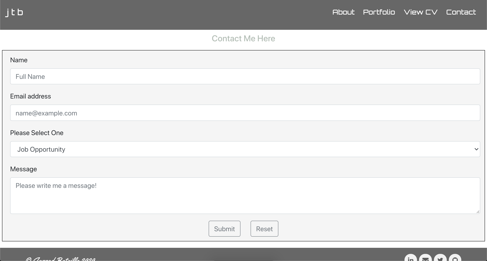

# React Portfolio
[](https://opensource.org/licenses/MIT)

## Table of Contents
* [Description](#description)
* [Viewing](#viewing)
* [Technologies Used](#technologies-used)
* [Application Demo](#application-demo)
* [Contact Information](#contact-information)

## Description
This website will allow curious voyeurs to view more information about me including my education and work history, skills I possess for coding and/or the day-to-day of working and living in this world, as well as viewing a multitude of projects and application I have built over the course of my coding journey!

Visitors to my site will arrive at the Home page with a short description of myself, but they may navigate to my Portfolio proper (with a view at some of my applications--with links to their repositories as well as their deployed sites if applicable), to my ```View CV``` page which will redirect visitors to a Google PDF of my CV, as well as a Contact page to submit a form for any questions or opportunities!

Moreover, don't forget to check out the **Footer** as it houses icon-links to my LinkedIn, GitHub, Twitter, and a ```MailTo``` option to email me directly!

## Viewing
My portfolio website is deployed on [GitHub Pages](#) if you wish to read more about me as well as view some of the many projects and applications I have built solo or in conjunction with other coders!

## Technologies Used
Node JS, JavaScript, HTML, CSS, JSX, React, Bootstrap, Font Awesome, React-DOM, React-Router-DOM

## Application Demo
Upon accessing my website at [GitHub Pages](#), visitors will see my homepage displayed as such:




From here, visitors can navigate one NavBar Icon over to my Portfolio-proper to view some of my team and solo applications, as well as a view of my skills at the bottom of the page:



Moving one more Navbar Icon over, visitors will be redirected in a new window to view my CV:



Finally, there is a Contact page from which users will be able to send me a message about anything contained in the drop-down selector so that they can keep me updated:



## Contact Information
* Jarrod Bataille
  * Portfolio Webpage: https://jtbataille.github.io/ (**vanilla HTML**)
  * GitHub Profile: https://github.com/jtbataille
  * E-mail Address: jtbataille@gmail.com